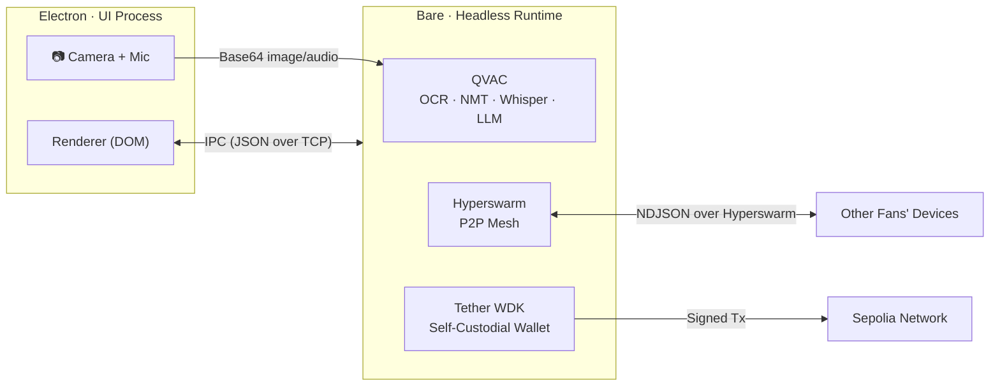

# Ninety

### When the final whistle blows and 80,000 phones kill the network, Ninety is the only app still working.

A peer-to-peer matchday companion that runs without internet.  
Translate signs. Share warnings. Find missing people. Send payments.  
No servers. No cloud. No signal required.

**Built with [Pears](https://docs.pears.com) · [QVAC](https://docs.pears.com) · [Tether WDK](https://github.com/tether/wdk)**

[](#verified-not-just-tested)
[](#minute-2--your-phone-becomes-a-stadium-brain)
[](#minute-1--a-sign-you-cant-read)
[](LICENSE)

---

## The Problem in One Sentence

Every major stadium event creates the same failure: tens of thousands of phones saturate the cellular network, and every app that depends on the cloud — maps, translators, payment apps, messaging — stops working at the exact moment fans need them most.

Ninety was built for that moment.

---

## Follow One Fan Through a Stadium Blackout

Everything Ninety does is visible in a single journey. Each section below follows one fan — from entering a foreign stadium to finding a lost friend — and every feature appears only when the story needs it.

---

### Minute 1 · A Sign You Can't Read

You walk into a stadium in a country where you don't speak the language. There's a warning sign above the gate. Your translation app spins — no connection.

You open Ninety. Point your camera at the sign. The text appears in your language instantly.

**How this works without internet:**

Ninety loads four AI models directly into the application process at startup — no API calls, no cloud, no network round-trips. The sign flows through two of them back-to-back:

| Model | Runtime | Size | Job |
|-------|---------|------|-----|
| GGML OCR Latin | C++ in-process | ~20 MB | Extract text from the camera image |
| Bergamot NMT | Marian C++ in-process | ~30 MB | Translate the extracted text |

Both run inside [QVAC SDK](https://docs.pears.com) — a toolkit that packages quantized C++ neural network runtimes as native plugins for the [Bare](https://docs.pears.com) JavaScript runtime. The models download once on first launch, then run entirely from cache.

**Translation supports 10 languages** (20 directional pairs): English, Spanish, French, German, Italian, Portuguese, Dutch, Russian, Japanese, Korean, and Chinese. Language pairs hot-swap at runtime — the old model unloads and the new one loads without restarting the app.

> **Why QVAC instead of a cloud API?**  
> Cloud translation APIs need a network connection — the exact thing that fails in a crowded stadium. PyTorch and HuggingFace runtimes are too heavy to embed in a desktop app. QVAC solves both: production-grade inference at native speed, zero network dependency, packaged as a plugin that loads inside the Bare runtime process.

---

### Minute 3 · Warning the Section

That sign said "Gate 7 closed — use Gate 12." Other fans are walking toward Gate 7. You tap **Broadcast**. Every nearby phone running Ninety receives the warning.

**How devices find each other without a server:**

Ninety uses [Pears and Hyperswarm](https://docs.pears.com) to form an ad-hoc mesh network. When you start a match session, Ninety joins a shared 32-byte topic on the Hyperswarm DHT. Every device that joins the same topic discovers every other device directly — no signaling server, no WebSocket relay, no central coordinator.

```
┌──────────┐         Hyperswarm DHT          ┌──────────┐
│  Your    │◄──── Topic: 191793e5... ────►│  Fan     │
│  Phone   │     (32-byte match key)        │  Nearby  │
└────┬─────┘                                 └────┬─────┘
     │            TCP + NDJSON framing            │
     └──────────────────┬─────────────────────────┘
                        │
                   ┌────┴─────┐
                   │  More    │
                   │  Peers   │
                   └──────────┘
```

Messages are serialized as JSON and delimited with newlines (NDJSON). Every connected peer receives every broadcast — flood gossip with no routing table.

> **The hardest networking bug wasn't peer discovery.**
>
> TCP does not preserve message boundaries. Two JSON payloads sent in quick succession can merge inside the socket buffer, or one payload can fragment across two `data` events. Parsing a merged buffer throws a `SyntaxError` and crashes the process.
>
> We solved this with [NDJSON framing](lib/mesh.js#L54-L80). Every outgoing message is appended with `\n`. The receiver accumulates a string buffer and splits at newline boundaries, processing each line independently. Malformed frames are silently discarded without dropping the TCP connection — critical in a stadium environment where packet loss and reordering are constant.

---

### Minute 5 · Your Battery Is Dying

Your phone is at 5%. Running the local LLM will kill it. But you need a recommendation: which exit should you use based on the tips other fans have shared?

You tap **Offload**. Ninety finds a peer whose device has battery and compute to spare. It sends your query over the mesh, the peer runs the LLM locally, and the result comes back in under 5 seconds.

**But how do you pay a stranger for compute?**

Before the query leaves your device, Ninety locks **0.01 USD₮** in an on-chain escrow contract. If the peer returns a valid result, the funds release to them. If they time out, disconnect, or return garbage — your device automatically reclaims the deposit.

This is the same `ReuniteEscrow` contract (below), reused with a `compute:` prefix namespace to isolate compute job IDs from safety bounties. No new contract deployment. Same state machine: **lock → verify → release/refund**.

> **Why not just trust the peer?**
>
> In a trustless ad-hoc network, you can't. Escrow-backed compute creates an honest incentive: peers earn real USD₮ for helping, and requesters never lose funds to non-delivery. The compute escrow uses a **5-minute** refund timeout (vs. 24 hours for safety bounties) because compute jobs resolve in seconds, not hours.

---

### Minute 8 · A Child Goes Missing

A parent nearby activates **Reunite**. They post a photo of their missing child with a **10 USD₮** search bounty. Every device in the section receives the alert.

**Transmitting a photo over a lossy mesh is harder than it sounds.**

Raw image files block the TCP socket queue, starving time-sensitive control messages (safety warnings, payment confirmations). Ninety compresses the photo to JPEG, converts it to base64, and slices it into **16 KB chunks** with index metadata. Chunks gossip across the mesh independently. Each peer buffers them in memory and reassembles the original image once all chunks arrive.

**The bounty is held in a smart contract, not a wallet.**

The parent's USD₮ moves into [`ReuniteEscrow.sol`](contracts/src/ReuniteEscrow.sol) — a Solidity contract deployed on Sepolia that enforces three rules:

1. **Only the reporter can release funds** to a confirmed finder
2. **Only the reporter can reclaim** — and only after a 24-hour timeout
3. **Double-pay and double-refund are impossible** — the contract reverts with typed errors

```
postBounty(alertId, amount)     →  USD₮ locked, status = Active
confirmFinder(alertId, finder)  →  USD₮ sent to finder, status = Paid
reclaim(alertId)                →  USD₮ returned (only after timeout)
```

> **Why every byte of this contract matters:**
>
> Writing to EVM storage is the most expensive operation on Ethereum. A naively structured `Alert` struct would use 5 storage slots. We [packed it into 3](contracts/src/ReuniteEscrow.sol#L16-L22):
>
> | Slot | Fields | Bytes Used |
> |------|--------|------------|
> | 0 | `reporter` (address, 20B) + `status` (enum, 1B) | 21 / 32 |
> | 1 | `finder` (address, 20B) + `createdAt` (uint64, 8B) | 28 / 32 |
> | 2 | `amount` (uint256, 32B) | 32 / 32 |
>
> Custom errors instead of `require("string")` reduced the deployed bytecode to **5,528 bytes** and capped deployment cost at **1,128,415 gas**. The contract ships with **23 Foundry tests** (including 2 fuzz tests and boundary-condition coverage) — all passing.

---

### Minute 12 · You Find the Child

You spot the child near Gate 12. You tap **Found**. The parent verifies and releases the escrow.

But the parent's phone has no signal. The Sepolia RPC is unreachable.

**This is where most wallet integrations break.**

Standard web3 libraries throw an exception when the node provider disconnects, crashing the payment flow. Ninety's [wallet module](lib/wallet.js) catches connection errors, signs the transaction locally using the private key derived from a BIP-39 mnemonic stored on-device, and queues it as `pending`. A background service polls for connectivity and automatically flushes the queue when the RPC becomes reachable again.

The entire wallet lifecycle is self-custodial through [Tether WDK](https://github.com/tether/wdk):

- **Key generation**: `WDK.getRandomSeedPhrase()` → saved to `~/.ninety/wallet-seed.txt`
- **Account derivation**: BIP-44 path `m/44'/60'/0'/0/0`
- **Token transfers**: ERC-20 `transfer()` on Sepolia USD₮
- **Escrow interactions**: `approve()` → `postBounty()` → `confirmFinder()` / `reclaim()`

No server ever holds the user's private key. No hosted wallet provider. Funds are controlled entirely by the seed phrase on the user's device.

> **Why Tether WDK instead of ethers.js alone?**  
> WDK handles the full self-custodial lifecycle — seed generation, secure storage, key derivation, and transaction management — as a single integrated SDK. Building this from ethers.js primitives would require reimplementing seed management, account indexing, and token balance tracking. WDK provides this out of the box, designed specifically for USD₮ workflows.

---

### Minute 15 · The AI Briefing

You're about to leave the stadium. Ninety has accumulated tips from dozens of nearby fans, safety alerts, sign translations, and match updates. You tap **Briefing** and hold your phone to your ear.

A 20-second spoken summary plays — generated entirely on-device by the same **Qwen 3 600M** (4-bit quantized, ~380 MB) LLM that powers Scout recommendations. It covers safety alerts first, then missing-person alerts, then food, transport, and queues — skipping any category with no data rather than saying "no information available."

The briefing is capped at 130 words by a post-processing guard that trims at sentence boundaries. Text-to-speech converts it to audio in the Electron renderer.

---

## Architecture

Ninety runs as two processes connected by a loopback TCP socket:



**Why two processes?**

The Electron renderer handles camera capture, microphone input, and DOM rendering. The Bare runtime runs the C++ AI models, the Hyperswarm mesh, and the WDK wallet. Separating them means a crash in the AI pipeline never kills the UI, and the renderer's garbage collector never pauses the mesh network.

Communication between the two processes uses the same NDJSON framing as the peer mesh — JSON objects delimited by newlines over a TCP socket, with a command-ID correlation system for request-response pairs.

---

## What a Fan Can Do

### 🔍 Understand
- **OCR** — extract text from signs, tickets, and maps using C++ GGML bindings
- **Translate** — 20 language pairs via Bergamot neural machine translation
- **Transcribe** — speech-to-text via Whisper.cpp (with [silence-hallucination filtering](lib/qvac.js#L352-L360))
- **Phrasebook** — offline emergency and matchday phrases

### 📡 Connect
- **Mesh discovery** — Hyperswarm DHT, no signaling server
- **Tip gossip** — broadcast crowd-sourced stadium tips to all peers
- **Sign relay** — share translated sign readings with your section
- **Match pulse** — live score and stadium notices over the mesh

### 🧠 Coordinate
- **Scout AI** — Qwen LLM combines signs, tips, and context into recommendations
- **Match briefing** — 20-second spoken stadium summary from live data
- **Compute offload** — delegate LLM queries to peers, pay 0.01 USD₮ via escrow

### 🛡️ Protect
- **Reunite alerts** — gossip missing-person photos across the mesh (16KB chunked)
- **Bounty escrow** — lock USD₮ search rewards in [`ReuniteEscrow.sol`](contracts/src/ReuniteEscrow.sol)
- **Contribution board** — track tips shared, alerts resolved, compute provided

### 💸 Transact
- **Self-custodial wallet** — WDK-managed keys, BIP-39 seed, on-device signing
- **QR payments** — scan or generate wallet address QR codes via camera
- **Offline queue** — sign transactions locally, auto-broadcast when signal returns
- **On-chain audit** — every escrow and payment linked to Sepolia Etherscan

---

## Verified, Not Just Tested

| Layer | Tests | Tool | What's Covered |
|-------|-------|------|----------------|
| Smart contract | **23/23** (incl. 2 fuzz) | Foundry | All 10 custom errors, reentrancy, timeout boundary, storage isolation, multi-reporter |
| Scout AI | 21 | Bare | Prompt construction, JSON fallback parsing, delegation timeout, peer disconnect |
| Compute escrow | 14 | Bare | Full lifecycle (lock→compute→release), refund reasons, concurrent jobs |
| Match briefing | 10 | Bare | Length enforcement, TTS safety, malformed output recovery |
| On-chain proof | 12 | Bare | Explorer URLs, history trimming, Foundry metadata rendering |
| **Total** | **~80** | | |

```bash
# Run everything
npm test                      # JS: bare test.js && bare test-compute-escrow.js && ...
cd contracts && forge test    # Solidity: 23/23, gas report available via forge test --gas-report
```

---

## Run the Demo

### Prerequisites
- **Bare Runtime** — `npm i -g bare`
- **Node.js** ≥ 22.17.0
- **Foundry** (for contract tests)

### Install
```bash
git clone https://github.com/Faleesha-Zaeen/Ninety.git
cd Ninety && npm install
```

### Launch Two Peers
**Terminal 1** (creates a match session):
```bash
npm run ui:peer1
```
Copy the **Match ID** from the top-right corner.

**Terminal 2** (joins the session):
```bash
npm run ui:peer2 -- --topic <MATCH_ID>
```

Both peers are now connected. Open the **Read** tab to OCR a sign, switch to **Connect** to share tips, or activate **Reunite** to test the full escrow flow with on-chain proof.

---

## Repository

```
Ninety/
├── contracts/
│   ├── src/ReuniteEscrow.sol        # Packed-storage bounty & compute escrow
│   ├── test/ReuniteEscrow.t.sol     # 23 Foundry tests (2 fuzz)
│   └── foundry-report.json          # Gas & size metrics snapshot
├── electron/
│   ├── main.cjs                     # IPC bridge, backend spawn, TCP transport
│   ├── preload.cjs                  # Context-isolated API surface
│   └── renderer/                    # UI (2,484 lines, append-only DOM)
├── lib/
│   ├── mesh.js                      # Hyperswarm mesh + NDJSON framing
│   ├── qvac.js                      # OCR, translation, Whisper, LLM
│   ├── scout.js                     # AI recommendations + compute delegation
│   ├── wallet.js                    # WDK wallet + offline signing queue
│   └── onchain.js                   # Etherscan proof panel
├── test.js                          # Scout AI unit tests
├── test-compute-escrow.js           # Compute escrow lifecycle tests
├── test-match-briefing.js           # Briefing generation tests
├── test-onchain-proof.js            # On-chain audit tests
└── package.json                     # 13 runtime deps + 1 dev (Electron)
```

---

## What's Next

- **Hypercore persistence** — save tips and chat history to an append-only log, no central database
- **Local TTS** — replace browser speech synthesis with an on-device model
- **Multi-token escrow** — extend `ReuniteEscrow` to accept any ERC-20 stablecoin

---

<div align="center">

**Ninety** — MIT License

Built for the [Tether Developers Cup 2026](https://developers.tether.io)

</div>
